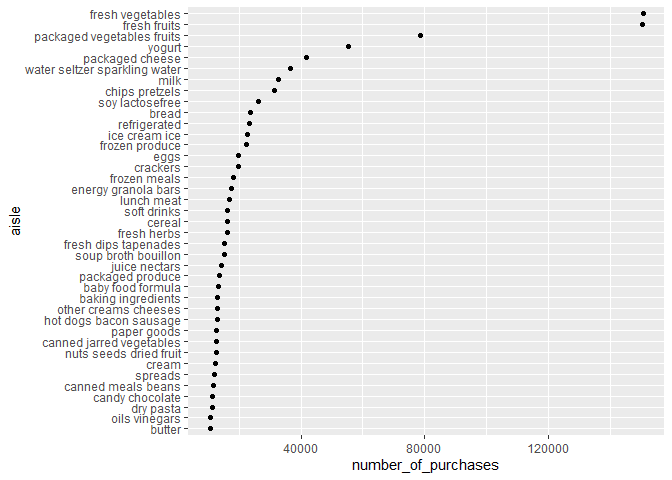
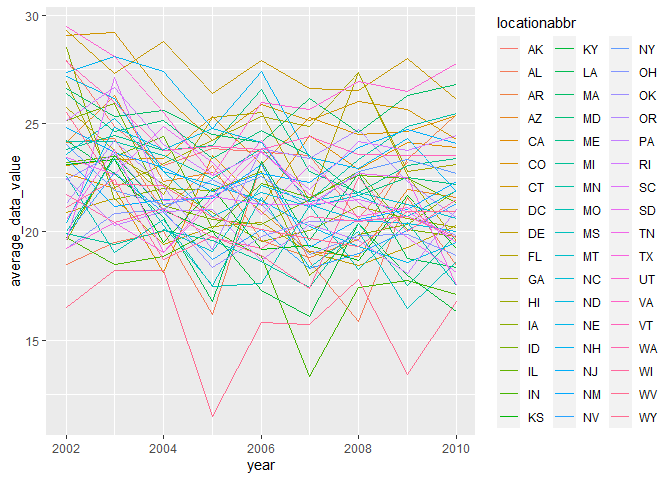
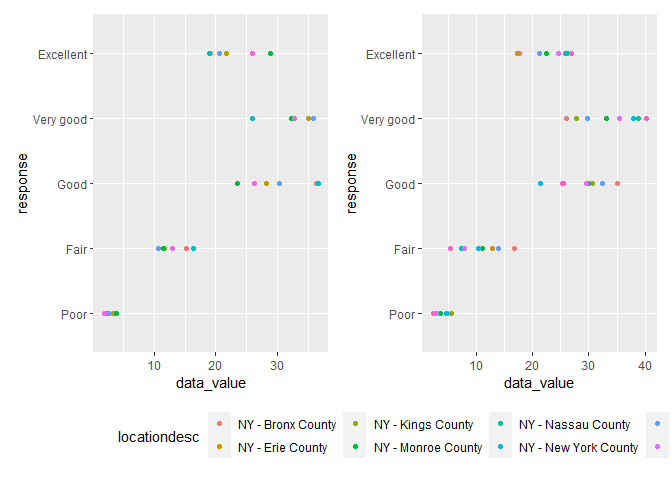

p8105\_hw3\_dr3168
================
Daniela Rochez
10/14/2021

``` r
library(tidyverse)
```

    ## -- Attaching packages --------------------------------------- tidyverse 1.3.1 --

    ## v ggplot2 3.3.5     v purrr   0.3.4
    ## v tibble  3.1.4     v dplyr   1.0.7
    ## v tidyr   1.1.3     v stringr 1.4.0
    ## v readr   2.0.1     v forcats 0.5.1

    ## -- Conflicts ------------------------------------------ tidyverse_conflicts() --
    ## x dplyr::filter() masks stats::filter()
    ## x dplyr::lag()    masks stats::lag()

``` r
library(p8105.datasets)
library(forcats)
library(patchwork)
library(skimr)
data("instacart")
str(instacart)
```

    ## tibble [1,384,617 x 15] (S3: tbl_df/tbl/data.frame)
    ##  $ order_id              : int [1:1384617] 1 1 1 1 1 1 1 1 36 36 ...
    ##  $ product_id            : int [1:1384617] 49302 11109 10246 49683 43633 13176 47209 22035 39612 19660 ...
    ##  $ add_to_cart_order     : int [1:1384617] 1 2 3 4 5 6 7 8 1 2 ...
    ##  $ reordered             : int [1:1384617] 1 1 0 0 1 0 0 1 0 1 ...
    ##  $ user_id               : int [1:1384617] 112108 112108 112108 112108 112108 112108 112108 112108 79431 79431 ...
    ##  $ eval_set              : chr [1:1384617] "train" "train" "train" "train" ...
    ##  $ order_number          : int [1:1384617] 4 4 4 4 4 4 4 4 23 23 ...
    ##  $ order_dow             : int [1:1384617] 4 4 4 4 4 4 4 4 6 6 ...
    ##  $ order_hour_of_day     : int [1:1384617] 10 10 10 10 10 10 10 10 18 18 ...
    ##  $ days_since_prior_order: int [1:1384617] 9 9 9 9 9 9 9 9 30 30 ...
    ##  $ product_name          : chr [1:1384617] "Bulgarian Yogurt" "Organic 4% Milk Fat Whole Milk Cottage Cheese" "Organic Celery Hearts" "Cucumber Kirby" ...
    ##  $ aisle_id              : int [1:1384617] 120 108 83 83 95 24 24 21 2 115 ...
    ##  $ department_id         : int [1:1384617] 16 16 4 4 15 4 4 16 16 7 ...
    ##  $ aisle                 : chr [1:1384617] "yogurt" "other creams cheeses" "fresh vegetables" "fresh vegetables" ...
    ##  $ department            : chr [1:1384617] "dairy eggs" "dairy eggs" "produce" "produce" ...
    ##  - attr(*, "spec")=
    ##   .. cols(
    ##   ..   order_id = col_integer(),
    ##   ..   product_id = col_integer(),
    ##   ..   add_to_cart_order = col_integer(),
    ##   ..   reordered = col_integer(),
    ##   ..   user_id = col_integer(),
    ##   ..   eval_set = col_character(),
    ##   ..   order_number = col_integer(),
    ##   ..   order_dow = col_integer(),
    ##   ..   order_hour_of_day = col_integer(),
    ##   ..   days_since_prior_order = col_integer(),
    ##   ..   product_name = col_character(),
    ##   ..   aisle_id = col_integer(),
    ##   ..   department_id = col_integer(),
    ##   ..   aisle = col_character(),
    ##   ..   department = col_character()
    ##   .. )

``` r
skim(instacart)
```

|                                                  |           |
|:-------------------------------------------------|:----------|
| Name                                             | instacart |
| Number of rows                                   | 1384617   |
| Number of columns                                | 15        |
| \_\_\_\_\_\_\_\_\_\_\_\_\_\_\_\_\_\_\_\_\_\_\_   |           |
| Column type frequency:                           |           |
| character                                        | 4         |
| numeric                                          | 11        |
| \_\_\_\_\_\_\_\_\_\_\_\_\_\_\_\_\_\_\_\_\_\_\_\_ |           |
| Group variables                                  | None      |

Data summary

**Variable type: character**

| skim\_variable | n\_missing | complete\_rate | min | max | empty | n\_unique | whitespace |
|:---------------|-----------:|---------------:|----:|----:|------:|----------:|-----------:|
| eval\_set      |          0 |              1 |   5 |   5 |     0 |         1 |          0 |
| product\_name  |          0 |              1 |   3 | 159 |     0 |     39123 |          0 |
| aisle          |          0 |              1 |   3 |  29 |     0 |       134 |          0 |
| department     |          0 |              1 |   4 |  15 |     0 |        21 |          0 |

**Variable type: numeric**

| skim\_variable            | n\_missing | complete\_rate |       mean |        sd |  p0 |    p25 |     p50 |     p75 |    p100 | hist  |
|:--------------------------|-----------:|---------------:|-----------:|----------:|----:|-------:|--------:|--------:|--------:|:------|
| order\_id                 |          0 |              1 | 1706297.62 | 989732.65 |   1 | 843370 | 1701880 | 2568023 | 3421070 | ▇▇▇▇▇ |
| product\_id               |          0 |              1 |   25556.24 |  14121.27 |   1 |  13380 |   25298 |   37940 |   49688 | ▆▆▇▆▇ |
| add\_to\_cart\_order      |          0 |              1 |       8.76 |      7.42 |   1 |      3 |       7 |      12 |      80 | ▇▁▁▁▁ |
| reordered                 |          0 |              1 |       0.60 |      0.49 |   0 |      0 |       1 |       1 |       1 | ▆▁▁▁▇ |
| user\_id                  |          0 |              1 |  103112.78 |  59487.15 |   1 |  51732 |  102933 |  154959 |  206209 | ▇▇▇▇▇ |
| order\_number             |          0 |              1 |      17.09 |     16.61 |   4 |      6 |      11 |      21 |     100 | ▇▂▁▁▁ |
| order\_dow                |          0 |              1 |       2.70 |      2.17 |   0 |      1 |       3 |       5 |       6 | ▇▂▂▂▆ |
| order\_hour\_of\_day      |          0 |              1 |      13.58 |      4.24 |   0 |     10 |      14 |      17 |      23 | ▁▃▇▇▃ |
| days\_since\_prior\_order |          0 |              1 |      17.07 |     10.43 |   0 |      7 |      15 |      30 |      30 | ▅▅▃▂▇ |
| aisle\_id                 |          0 |              1 |      71.30 |     38.10 |   1 |     31 |      83 |     107 |     134 | ▆▃▃▇▆ |
| department\_id            |          0 |              1 |       9.84 |      6.29 |   1 |      4 |       8 |      16 |      21 | ▇▂▂▅▂ |

``` r
#There are 1, 384, 617 observations with 15 variables. Some of these variables include order IDs, product IDs, and name of products. There are 134 aisles. The top three aisles with the most purchases is fresh fruits, fresh vegetables, and packaged vegatbles and fruits.
```

\#Counting amount of aisles

``` r
instacart %>% 
  count(aisle)
```

    ## # A tibble: 134 x 2
    ##    aisle                      n
    ##    <chr>                  <int>
    ##  1 air fresheners candles  1067
    ##  2 asian foods             7007
    ##  3 baby accessories         306
    ##  4 baby bath body care      328
    ##  5 baby food formula      13198
    ##  6 bakery desserts         1501
    ##  7 baking ingredients     13088
    ##  8 baking supplies decor   1094
    ##  9 beauty                   287
    ## 10 beers coolers           1839
    ## # ... with 124 more rows

\#Finding most popular aisles

``` r
instacart %>% 
  count(aisle) %>% 
    filter(min_rank(desc(n)) < 4)
```

    ## # A tibble: 3 x 2
    ##   aisle                           n
    ##   <chr>                       <int>
    ## 1 fresh fruits               150473
    ## 2 fresh vegetables           150609
    ## 3 packaged vegetables fruits  78493

\#Making a plot for the number of orders in each aisle

``` r
instacart %>% 
  count(aisle) %>% 
  rename(number_of_purchases=n) %>% 
    filter(number_of_purchases>10000) %>% 
      mutate(aisle=fct_reorder(aisle, number_of_purchases ))%>% 
        ggplot(aes(x = aisle, y = number_of_purchases ))+
          geom_point()+
           coord_flip()
```

<!-- -->

``` r
#Does this look correct?
```

\#Making a table for popular products in certain aisles

``` r
instacart %>% 
  filter(aisle %in% c("baking ingredients", 
          "dog food care", "packaged vegetables fruits")) %>% 
    group_by(aisle,product_name) %>% 
     summarize(n_obs = n()) %>% 
      filter(min_rank(desc(n_obs)) < 4) %>% 
    knitr::kable(digits = 1)
```

    ## `summarise()` has grouped output by 'aisle'. You can override using the `.groups` argument.

| aisle                      | product\_name                                 | n\_obs |
|:---------------------------|:----------------------------------------------|-------:|
| baking ingredients         | Cane Sugar                                    |    336 |
| baking ingredients         | Light Brown Sugar                             |    499 |
| baking ingredients         | Pure Baking Soda                              |    387 |
| dog food care              | Organix Chicken & Brown Rice Recipe           |     28 |
| dog food care              | Small Dog Biscuits                            |     26 |
| dog food care              | Snack Sticks Chicken & Rice Recipe Dog Treats |     30 |
| packaged vegetables fruits | Organic Baby Spinach                          |   9784 |
| packaged vegetables fruits | Organic Blueberries                           |   4966 |
| packaged vegetables fruits | Organic Raspberries                           |   5546 |

\#Making Pink Lady table

``` r
instacart %>% 
  filter(product_name %in% c("Pink Lady Apples", "Coffee Ice Cream"))%>%    group_by(product_name, order_dow) %>% 
    summarize(mean_orders=mean(order_hour_of_day)) %>% 
  mutate(order_dow= recode(order_dow, `0`="Sunday",`1`="Monday",                   `2`="Tuesday", `3`="Wednesday",`4`="Thursday",`5`="Friday",
          `6`="Saturday")) %>% 
  pivot_wider(names_from = product_name,values_from = mean_orders) %>% 
    knitr::kable(digits = 1)
```

    ## `summarise()` has grouped output by 'product_name'. You can override using the `.groups` argument.

| order\_dow | Coffee Ice Cream | Pink Lady Apples |
|:-----------|-----------------:|-----------------:|
| Sunday     |             13.8 |             13.4 |
| Monday     |             14.3 |             11.4 |
| Tuesday    |             15.4 |             11.7 |
| Wednesday  |             15.3 |             14.2 |
| Thursday   |             15.2 |             11.6 |
| Friday     |             12.3 |             12.8 |
| Saturday   |             13.8 |             11.9 |

``` r
#Does this also look correct? Should I convert the values to hrs?
```

\#BRFSS Data

``` r
data("brfss_smart2010")
str(brfss_smart2010)
```

    ## tibble [134,203 x 23] (S3: tbl_df/tbl/data.frame)
    ##  $ Year                      : int [1:134203] 2010 2010 2010 2010 2010 2010 2010 2010 2010 2010 ...
    ##  $ Locationabbr              : chr [1:134203] "AL" "AL" "AL" "AL" ...
    ##  $ Locationdesc              : chr [1:134203] "AL - Jefferson County" "AL - Jefferson County" "AL - Jefferson County" "AL - Jefferson County" ...
    ##  $ Class                     : chr [1:134203] "Health Status" "Health Status" "Health Status" "Health Status" ...
    ##  $ Topic                     : chr [1:134203] "Overall Health" "Overall Health" "Overall Health" "Overall Health" ...
    ##  $ Question                  : chr [1:134203] "How is your general health?" "How is your general health?" "How is your general health?" "How is your general health?" ...
    ##  $ Response                  : chr [1:134203] "Excellent" "Very good" "Good" "Fair" ...
    ##  $ Sample_Size               : int [1:134203] 94 148 208 107 45 450 152 524 77 316 ...
    ##  $ Data_value                : num [1:134203] 18.9 30 33.1 12.5 5.5 82 18 79.3 20.7 74.9 ...
    ##  $ Confidence_limit_Low      : num [1:134203] 14.1 24.9 28.2 9.5 3.5 78.6 14.6 74 15.4 68.6 ...
    ##  $ Confidence_limit_High     : num [1:134203] 23.6 35 38 15.4 7.4 85.3 21.3 84.5 25.9 81.1 ...
    ##  $ Display_order             : int [1:134203] 1 2 3 4 5 6 7 8 9 10 ...
    ##  $ Data_value_unit           : chr [1:134203] "%" "%" "%" "%" ...
    ##  $ Data_value_type           : chr [1:134203] "Crude Prevalence" "Crude Prevalence" "Crude Prevalence" "Crude Prevalence" ...
    ##  $ Data_Value_Footnote_Symbol: chr [1:134203] NA NA NA NA ...
    ##  $ Data_Value_Footnote       : chr [1:134203] NA NA NA NA ...
    ##  $ DataSource                : chr [1:134203] "BRFSS" "BRFSS" "BRFSS" "BRFSS" ...
    ##  $ ClassId                   : chr [1:134203] "CLASS08" "CLASS08" "CLASS08" "CLASS08" ...
    ##  $ TopicId                   : chr [1:134203] "Topic41" "Topic41" "Topic41" "Topic41" ...
    ##  $ LocationID                : chr [1:134203] NA NA NA NA ...
    ##  $ QuestionID                : chr [1:134203] "GENHLTH" "GENHLTH" "GENHLTH" "GENHLTH" ...
    ##  $ RESPID                    : chr [1:134203] "RESP056" "RESP057" "RESP058" "RESP059" ...
    ##  $ GeoLocation               : chr [1:134203] "(33.518601, -86.814688)" "(33.518601, -86.814688)" "(33.518601, -86.814688)" "(33.518601, -86.814688)" ...
    ##  - attr(*, "spec")=
    ##   .. cols(
    ##   ..   Year = col_integer(),
    ##   ..   Locationabbr = col_character(),
    ##   ..   Locationdesc = col_character(),
    ##   ..   Class = col_character(),
    ##   ..   Topic = col_character(),
    ##   ..   Question = col_character(),
    ##   ..   Response = col_character(),
    ##   ..   Sample_Size = col_integer(),
    ##   ..   Data_value = col_double(),
    ##   ..   Confidence_limit_Low = col_double(),
    ##   ..   Confidence_limit_High = col_double(),
    ##   ..   Display_order = col_integer(),
    ##   ..   Data_value_unit = col_character(),
    ##   ..   Data_value_type = col_character(),
    ##   ..   Data_Value_Footnote_Symbol = col_character(),
    ##   ..   Data_Value_Footnote = col_character(),
    ##   ..   DataSource = col_character(),
    ##   ..   ClassId = col_character(),
    ##   ..   TopicId = col_character(),
    ##   ..   LocationID = col_character(),
    ##   ..   QuestionID = col_character(),
    ##   ..   RESPID = col_character(),
    ##   ..   GeoLocation = col_character()
    ##   .. )

``` r
brfss_smart2010 %>% 
  janitor::clean_names() %>% 
  filter(topic=="Overall Health") %>% 
  mutate(response =fct_relevel(response,c("Poor", "Fair", "Good", "Very good", "Excellent")))
```

    ## # A tibble: 10,625 x 23
    ##     year locationabbr locationdesc  class  topic  question  response sample_size
    ##    <int> <chr>        <chr>         <chr>  <chr>  <chr>     <fct>          <int>
    ##  1  2010 AL           AL - Jeffers~ Healt~ Overa~ How is y~ Excelle~          94
    ##  2  2010 AL           AL - Jeffers~ Healt~ Overa~ How is y~ Very go~         148
    ##  3  2010 AL           AL - Jeffers~ Healt~ Overa~ How is y~ Good             208
    ##  4  2010 AL           AL - Jeffers~ Healt~ Overa~ How is y~ Fair             107
    ##  5  2010 AL           AL - Jeffers~ Healt~ Overa~ How is y~ Poor              45
    ##  6  2010 AL           AL - Mobile ~ Healt~ Overa~ How is y~ Excelle~          91
    ##  7  2010 AL           AL - Mobile ~ Healt~ Overa~ How is y~ Very go~         177
    ##  8  2010 AL           AL - Mobile ~ Healt~ Overa~ How is y~ Good             224
    ##  9  2010 AL           AL - Mobile ~ Healt~ Overa~ How is y~ Fair             120
    ## 10  2010 AL           AL - Mobile ~ Healt~ Overa~ How is y~ Poor              66
    ## # ... with 10,615 more rows, and 15 more variables: data_value <dbl>,
    ## #   confidence_limit_low <dbl>, confidence_limit_high <dbl>,
    ## #   display_order <int>, data_value_unit <chr>, data_value_type <chr>,
    ## #   data_value_footnote_symbol <chr>, data_value_footnote <chr>,
    ## #   data_source <chr>, class_id <chr>, topic_id <chr>, location_id <chr>,
    ## #   question_id <chr>, respid <chr>, geo_location <chr>

\#States observed at more than 7 locations in 2002

``` r
brfss_smart2010 %>% 
  janitor::clean_names() %>% 
  filter(year==2002 & topic =="Overall Health") %>% 
  group_by(locationabbr) %>% 
  distinct(locationdesc) %>% 
  summarise(n_obs=n())%>% 
  filter(n_obs >=7)
```

    ## # A tibble: 6 x 2
    ##   locationabbr n_obs
    ##   <chr>        <int>
    ## 1 CT               7
    ## 2 FL               7
    ## 3 MA               8
    ## 4 NC               7
    ## 5 NJ               8
    ## 6 PA              10

``` r
#The states that were observed at 7 or more locations in 2002 was Connecticut, Florida, Massachusetts, North Carolina, New Jersey, and Pennsylvania
```

\#States observed at more than 7 locations in 2010

``` r
brfss_smart2010 %>% 
  janitor::clean_names() %>% 
  filter(year==2010 & topic =="Overall Health") %>% 
  group_by(locationabbr) %>% 
  distinct(locationdesc) %>% 
  summarise(n_obs=n())%>% 
  filter(n_obs >=7)
```

    ## # A tibble: 14 x 2
    ##    locationabbr n_obs
    ##    <chr>        <int>
    ##  1 CA              12
    ##  2 CO               7
    ##  3 FL              41
    ##  4 MA               9
    ##  5 MD              12
    ##  6 NC              12
    ##  7 NE              10
    ##  8 NJ              19
    ##  9 NY               9
    ## 10 OH               8
    ## 11 PA               7
    ## 12 SC               7
    ## 13 TX              16
    ## 14 WA              10

``` r
#The states that were observed at 7 or more locationsin 2010 were California, Colorado, Florida, Massachusetts,Maryland, North Carolina,New England, New Jersey,New York, Ohio, Pennsylvania South Carolina, Texas, and Washington.
```

\#New dataset

``` r
brfss_smart2010 %>% 
  janitor::clean_names() %>% 
  filter(response== "Excellent" & topic =="Overall Health") %>%
  group_by(year, locationabbr) %>% 
  summarize(average_data_value= mean(data_value, na.rm=T)) %>% 
  ggplot(aes(x = year, y = average_data_value, color=locationabbr)) + 
  geom_line()
```

    ## `summarise()` has grouped output by 'year'. You can override using the `.groups` argument.

<!-- -->
\#Two panel plot

``` r
data_value_2006= 
  brfss_smart2010 %>% 
  janitor::clean_names() %>% 
  filter(year==2006 & topic =="Overall Health") %>%
  filter(locationabbr=="NY") %>% 
  mutate(response =fct_relevel(response,c("Poor", "Fair", "Good", "Very good", "Excellent")))%>%
  ggplot(aes(x = response, y = data_value)) + 
  geom_point(aes(color = locationdesc)) +
  theme(legend.position = "none")+
   coord_flip()

data_value_2010= 
  brfss_smart2010 %>% 
  janitor::clean_names() %>% 
  filter(year==2010 & topic =="Overall Health") %>%
  filter(locationabbr=="NY") %>% 
  mutate(response =fct_relevel(response,c("Poor", "Fair", "Good", "Very good", "Excellent")))%>%
  ggplot(aes(x = response, y = data_value)) + 
  geom_point(aes(color = locationdesc)) +
  theme(legend.position = "bottom")+
   coord_flip()

data_value_2006+data_value_2010
```

<!-- -->

\#Loading accelerometer data

``` r
accel_data= read_csv("~/School/FALL 2021/P8105/p8105_hw3_dr3168/accel_data.csv")
```

    ## Rows: 35 Columns: 1443

    ## -- Column specification --------------------------------------------------------
    ## Delimiter: ","
    ## chr    (1): day
    ## dbl (1442): week, day_id, activity.1, activity.2, activity.3, activity.4, ac...

    ## 
    ## i Use `spec()` to retrieve the full column specification for this data.
    ## i Specify the column types or set `show_col_types = FALSE` to quiet this message.

``` r
summarise(accel_data)
```

    ## # A tibble: 1 x 0

``` r
accel_data
```

    ## # A tibble: 35 x 1,443
    ##     week day_id day       activity.1 activity.2 activity.3 activity.4 activity.5
    ##    <dbl>  <dbl> <chr>          <dbl>      <dbl>      <dbl>      <dbl>      <dbl>
    ##  1     1      1 Friday          88.4       82.2       64.4       70.0       75.0
    ##  2     1      2 Monday           1          1          1          1          1  
    ##  3     1      3 Saturday         1          1          1          1          1  
    ##  4     1      4 Sunday           1          1          1          1          1  
    ##  5     1      5 Thursday        47.4       48.8       46.9       35.8       49.0
    ##  6     1      6 Tuesday         64.8       59.5       73.7       45.7       42.4
    ##  7     1      7 Wednesday       71.1      103.        68.5       45.4       37.8
    ##  8     2      8 Friday         675        542       1010        779        509  
    ##  9     2      9 Monday         291        335        393        335        263  
    ## 10     2     10 Saturday        64         11          1          1          1  
    ## # ... with 25 more rows, and 1,435 more variables: activity.6 <dbl>,
    ## #   activity.7 <dbl>, activity.8 <dbl>, activity.9 <dbl>, activity.10 <dbl>,
    ## #   activity.11 <dbl>, activity.12 <dbl>, activity.13 <dbl>, activity.14 <dbl>,
    ## #   activity.15 <dbl>, activity.16 <dbl>, activity.17 <dbl>, activity.18 <dbl>,
    ## #   activity.19 <dbl>, activity.20 <dbl>, activity.21 <dbl>, activity.22 <dbl>,
    ## #   activity.23 <dbl>, activity.24 <dbl>, activity.25 <dbl>, activity.26 <dbl>,
    ## #   activity.27 <dbl>, activity.28 <dbl>, activity.29 <dbl>, ...

\#Tidying the data and naming variables

``` r
accel_tidy_data= 
  pivot_longer(
    accel_data, 
    activity.1:activity.1440,
    names_to = "activity_minute", 
    values_to = "activity_count")

accel_tidy_data %>% 
  mutate(weekday_or_weekend= recode(day, `Monday`= "Weekday", `Tuesday`="Weekday",`Wednesday`="Weekday",`Thursday`="Weekday",`Friday`="Weekday",`Saturday`= "Weekend", `Sunday`="Weekend"))
```

    ## # A tibble: 50,400 x 6
    ##     week day_id day    activity_minute activity_count weekday_or_weekend
    ##    <dbl>  <dbl> <chr>  <chr>                    <dbl> <chr>             
    ##  1     1      1 Friday activity.1                88.4 Weekday           
    ##  2     1      1 Friday activity.2                82.2 Weekday           
    ##  3     1      1 Friday activity.3                64.4 Weekday           
    ##  4     1      1 Friday activity.4                70.0 Weekday           
    ##  5     1      1 Friday activity.5                75.0 Weekday           
    ##  6     1      1 Friday activity.6                66.3 Weekday           
    ##  7     1      1 Friday activity.7                53.8 Weekday           
    ##  8     1      1 Friday activity.8                47.8 Weekday           
    ##  9     1      1 Friday activity.9                55.5 Weekday           
    ## 10     1      1 Friday activity.10               43.0 Weekday           
    ## # ... with 50,390 more rows

``` r
#There are 50,400 observations and 6 variables. These variables include the week, day of each week, each activity minute and the count per activity minute.
```

\#Total activity variable
